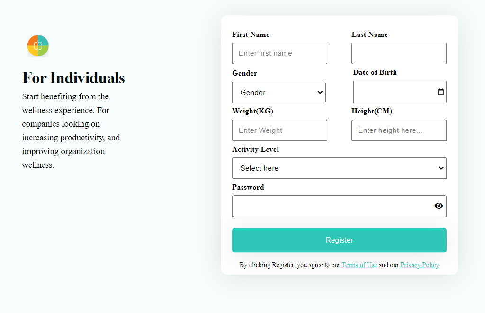
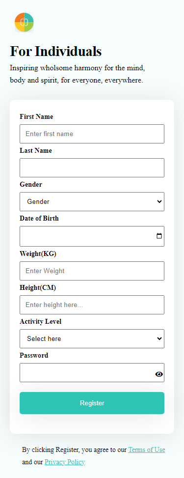

# ALtSchool Africa - Web Development Training

## Table of contents

- [Overview](#overview)
  - [Screenshot](#screenshot)
  - [Links](#links)
  - [Built with](#built-with)
- [Author](#author)
- [Acknowledgments](#acknowledgments)

## Overview

Individual sign up form to Improve wellness your wellness and increase productivity.

### Screenshot

### Links

- Solution URL: [Add solution URL here](https://your-solution-url.com)
- Live Site URL: [Add live site URL here](https://your-live-site-url.com)

### Built with

- Semantic HTML5 \*\*
- CSS custom \*\*
- Flexbox\*\*
- CSS Grid\*\*

## Author

- Github Profile - [@alfarukky](https://www.frontendmentor.io/profile/yourusername)

**Note: Delete this note and add/remove/edit lines above based on what links you'd like to share.**

## Acknowledgments

I express my sincere gratitude to _@altschoolafrica_ and to our mentor _@setemiojo_
